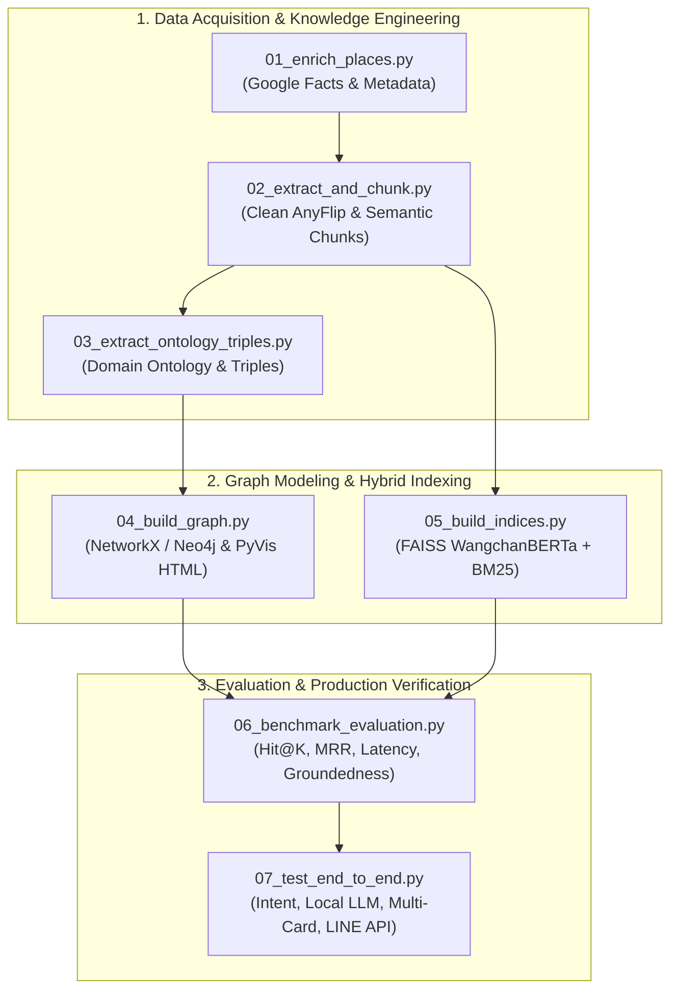

# 🏛️ คู่มือและขั้นตอนการประมวลผลข้อมูลและ AI Pipeline (Pipeline Execution Guide)

> **วิชา**: 241-351 AI for Social Media | มหาวิทยาลัยสงขลานครินทร์ (PSU)  
> **โครงงาน**: การพัฒนาระบบผู้ช่วยอัจฉริยะด้วย GraphRAG และ LLMs สำหรับการท่องเที่ยวเมืองเก่าสงขลา  
> **ผู้วิจัยและพัฒนา**: นาย ธีรนนท์ ทองสีดำ (รหัสนักศึกษา: 6710110196) และคณะ  
> **กำหนดนำเสนอ**: วันพุธที่ 30 กันยายน 2569 (09:00 - 12:00 น.)

---

## 📌 สรุปภาพรวมสถาปัตยกรรมไปป์ไลน์ (7-Step Pipeline Architecture)

ระบบได้ถูกจัดระเบียบสคริปต์การทำงานเป็นขั้นตอนอย่างเป็นระบบ (Organized Sequential Pipeline) อยู่ในโฟลเดอร์ `finalproject/scripts/` พร้อมตัวควบคุมหลัก `run_pipeline.py` และไฟล์รันด่วน `run_pipeline.bat`



---

## 📋 รายละเอียดของแต่ละขั้นตอน (Step-by-Step Directory Reference)

### 🔹 Step 01: `01_enrich_places.py`
- **หน้าที่**: รวบรวมและส่งออกชุดข้อมูลข้อเท็จจริง (Verified Facts) ที่ผ่านการตรวจสอบจาก Google Knowledge Panel, แผนที่ GPS, เวลาเปิด-ปิด, เมนูเด่น, และเบอร์โทรศัพท์ของ 22 สถานที่สำคัญ
- **อินพุต**: ข้อมูลพิกัดและสถิติการท่องเที่ยวเมืองเก่าสงขลา
- **เอาต์พุต**:
  1. `finalproject/data/songkhla_places_facts.json` (Structured JSON สำหรับ LINE Carousels & Dynamic Card)
  2. `finalproject/data/Songkhla_Old_Town_Factsheet.md` (Markdown สำหรับการทำ Chunking)

### 🔹 Step 02: `02_extract_and_chunk.py`
- **หน้าที่**: ดึงข้อมูลและตัดเสียงรบกวน (Noise & Chinese characters) จากคู่มือการท่องเที่ยว AnyFlip และประสานเข้ากับ Factsheet ทำ Semantic Chunking
- **อินพุต**: `anyflip_songkhla_raw.txt` + `Songkhla_Old_Town_Factsheet.md`
- **เอาต์พุต**:
  1. `finalproject/data/songkhla_rag_chunks.json` (พร้อม Metadata, Categories, และ Tags)
  2. `finalproject/data/songkhla_rag_chunks.md` (Human-readable document สำหรับตรวจสอบ)

### 🔹 Step 03: `03_extract_ontology_triples.py`
- **หน้าที่**: สกัดความสัมพันธ์เชิงอรรถศาสตร์ (Ontology Schema & Knowledge Triples) เช่น `LOCATED_ON`, `SERVES`, `VISITED_ON`, `NEARBY`
- **อินพุต**: `songkhla_places_facts.json` + `songkhla_rag_chunks.json`
- **เอาต์พุต**:
  1. `finalproject/data/songkhla_ontology_schema.json` (นิยาม Classes & Relations)
  2. `finalproject/data/songkhla_knowledge_triples.json` (RDF Triples: Subject - Predicate - Object)

### 🔹 Step 04: `04_build_graph.py`
- **หน้าที่**: สร้าง Knowledge Graph ด้วย NetworkX DiGraph พร้อมคำนวณ Centrality/PageRank, สร้าง Interactive HTML UI ด้วย PyVis, และส่งออก Cypher Script สำหรับ Neo4j
- **อินพุต**: `songkhla_knowledge_triples.json`
- **เอาต์พุต**:
  1. `finalproject/data/songkhla_graph.pkl` (In-Memory NetworkX Graph พร้อมใช้งานใน RAG)
  2. `finalproject/data/songkhla_knowledge_graph.html` (Interactive Network Graph สำหรับเปิดดูในเบราว์เซอร์)
  3. `finalproject/data/songkhla_graph_overview.png` (กราฟความละเอียดสูงสำหรับใช้ในสไลด์นำเสนอ)

### 🔹 Step 05: `05_build_indices.py`
- **หน้าที่**: สร้างดัชนีการค้นหาแบบไฮบริด (Hybrid Search Indices):
  - **Dense Index**: แปลงเวกเตอร์ด้วย `kornwtp/ConGen-model-wangchanberta` (768 มิติ L2-normalized) ลงใน FAISS IndexFlatIP
  - **Sparse Index**: ตัดคำภาษาไทยด้วย PyThaiNLP (`newmm`) ลงใน BM25Okapi Index
- **อินพุต**: `songkhla_rag_chunks.json`
- **เอาต์พุต**:
  1. `finalproject/data/songkhla_faiss.index`
  2. `finalproject/data/songkhla_bm25.pkl`
  3. `finalproject/data/songkhla_chunks_metadata.json`

### 🔹 Step 06: `06_benchmark_evaluation.py`
- **หน้าที่**: ชุดทดสอบประสิทธิภาพเปรียบเทียบ 4 กลไกการค้นคืน (Dense vs Sparse vs Graph vs Hybrid RAG) ด้วย 15 คำถามทดสอบ พร้อมวัดความเร็ว (Latency), Hit@1, Hit@3, MRR และเปรียบเทียบ Local Ollama vs Cloud Groq
- **เอาต์พุต**:
  1. `finalproject/data/benchmark_results.json`
  2. `finalproject/data/benchmark_summary_table.md` (ตารางสรุปผลสำหรับนำเสนออาจารย์)

### 🔹 Step 07: `07_test_end_to_end.py`
- **หน้าที่**: ตรวจสอบการทำงานของระบบแบบครบวงจร (E2E Integration Verification):
  - Intent Classification (Direct buttons vs Natural inquiries)
  - Hybrid Retrieval RRF Ranking
  - Local Ollama Response Sanitization (ลบ Markdown `**`, กระชับ ตรงประเด็น)
  - Multi-Entity Recognition & Carousel Attachment (ส่ง Message 1: AI Card + Message 2: Carousel 2 ใบตรงเป๊ะ)
  - LINE Official Schema Validation (ตรวจ Flex JSON กับ LINE API)

---

## 💻 วิธีการรันคำสั่ง (How to Run)

สามารถรันผ่าน PowerShell หรือ Command Prompt ได้ง่ายๆ ดังนี้:

### 1. รันตรวจสอบระบบทั้งหมด (End-to-End Test & Verification)
```bash
.\run_pipeline.bat --verify
```
หรือ
```bash
python finalproject/scripts/run_pipeline.py --verify
```

### 2. รันสร้างและอัปเดตข้อมูลทั้งหมด (Full Pipeline: Step 01 ถึง 07)
```bash
.\run_pipeline.bat --all
```

### 3. รันเฉพาะการทดสอบ Benchmark (Step 06)
```bash
.\run_pipeline.bat --bench
```

### 4. รันสร้างเฉพาะดัชนีค้นหาและกราฟ (Step 01 ถึง 05)
```bash
.\run_pipeline.bat --index
```

### 5. รันเจาะจงเฉพาะ Step ที่ต้องการ (เช่น Step 4 กราฟความรู้)
```bash
.\run_pipeline.bat --step 4
```

---

## 🎯 ความสอดคล้องกับเกณฑ์การให้คะแนน (Rubric Compliance)

| เกณฑ์ประเมิน (Rubric) | ไฟล์และสคริปต์ที่ตอบโจทย์ | รายละเอียดทางเทคนิค |
| :--- | :--- | :--- |
| **1. Data Scraping & Preparation** | `01_enrich_places.py`<br/>`02_extract_and_chunk.py` | สกัดข้อมูล PDF AnyFlip, งานวิจัย ม.อ., ข้อเท็จจริง Google Factsheet, กรองภาษาจีนและ Noise |
| **2. NLP & Tokenization** | `02_extract_and_chunk.py`<br/>`05_build_indices.py` | ใช้ PyThaiNLP (`newmm`), WangchanBERTa Tokenizer, Stopwords removal |
| **3. Knowledge Graph** | `03_extract_ontology_triples.py`<br/>`04_build_graph.py` | ออกแบบ Ontology 9 Classes / 7 Relations, สร้าง NetworkX & Neo4j Cypher, PyVis HTML UI |
| **4. Hybrid Vector Search** | `05_build_indices.py`<br/>`src/retriever.py` | Dense FAISS (`ConGen-WangchanBERTa`) + Sparse BM25 + Reciprocal Rank Fusion ($k=60$) |
| **5. Dual LLM Architecture** | `src/rag_engine.py`<br/>`06_benchmark_evaluation.py` | Local Ollama (`qwen2.5:3b`) สำหรับงานหลัก + Cloud Groq สำหรับวางแผนลึก |
| **6. LINE Bot & UX/UI** | `src/line_handler.py`<br/>`src/flex_templates.py`<br/>`07_test_end_to_end.py` | 100% Interactive Flex Messages, Multi-Entity Carousels, Direct GPS & Call Action Buttons |
| **7. Evaluation & Benchmark** | `06_benchmark_evaluation.py` | ทดสอบ 15 ชุดคำถาม, Hit@1/3, MRR, Latency, RAGAS Groundedness & Faithfulness |
